# Quizzy-Gen Application Flows

This document visualizes the key flows of the Quizzy-Gen application using Mermaid diagrams.

## System Architecture

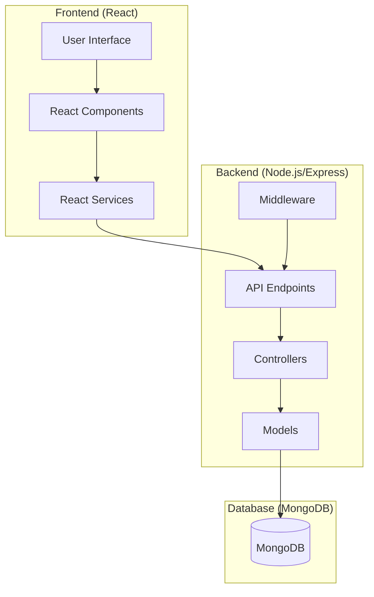

## Authentication Flow

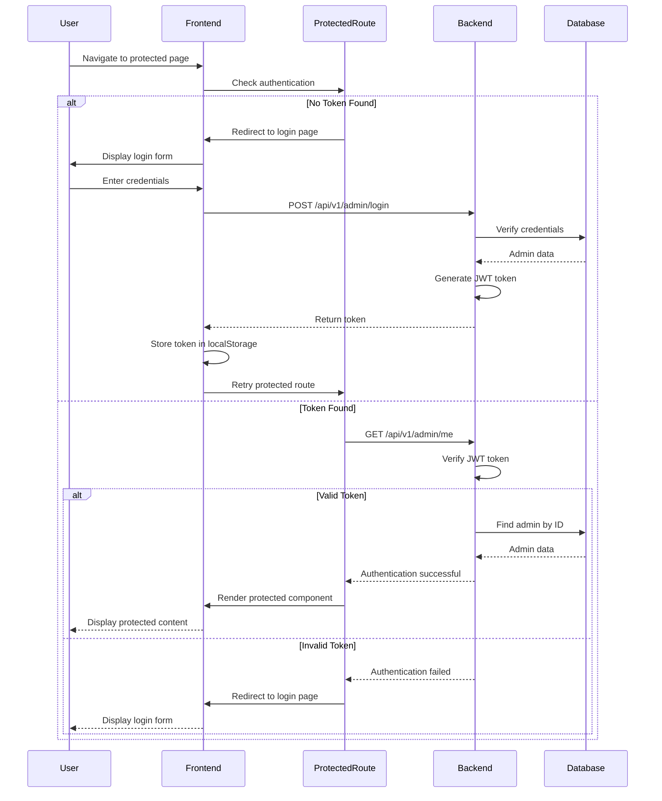

## User Flow: Taking a Quiz

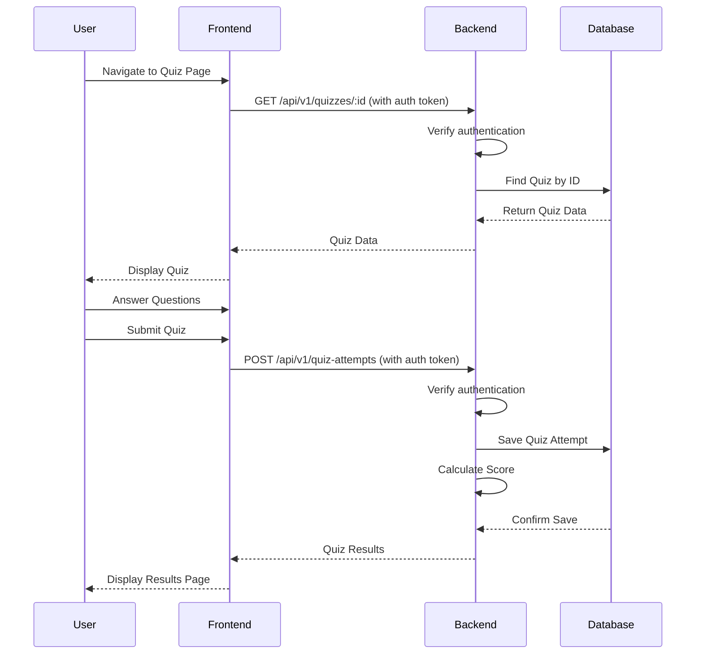

## User Flow: Creating a Quiz

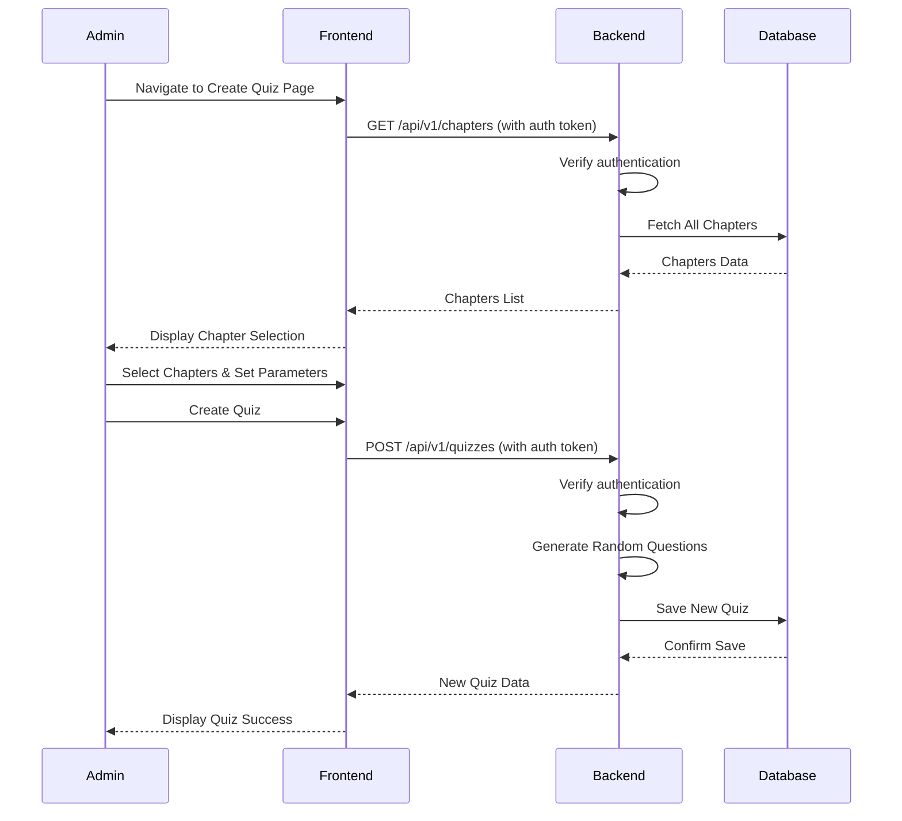

## Protected Routes Flow

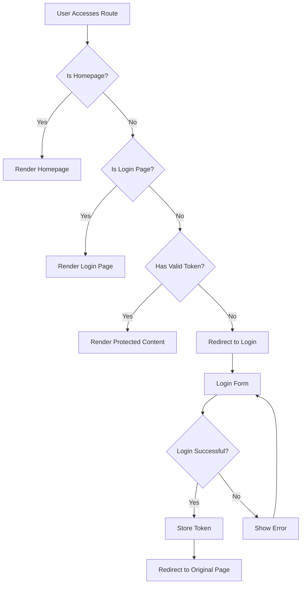

## Data Model

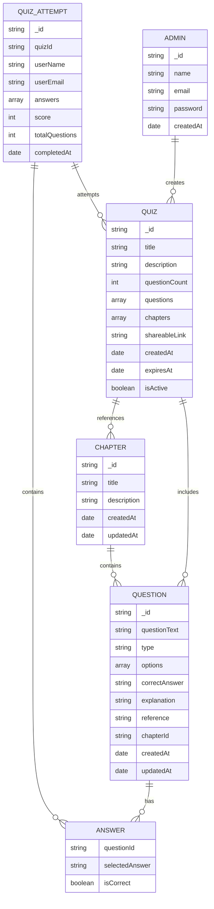

## API Flow: Quiz Submission and Results

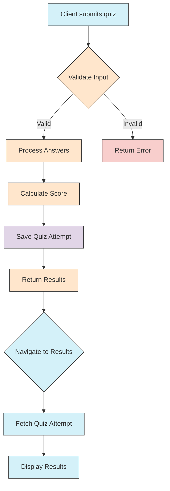

## Component Hierarchy

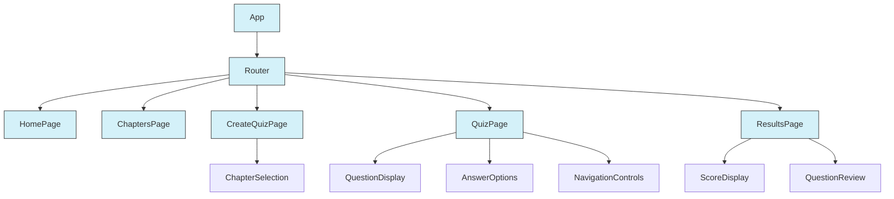

## Data Flow: Quiz Creation to Results

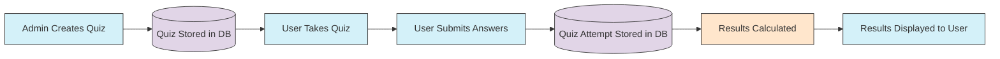

## Deployment Architecture

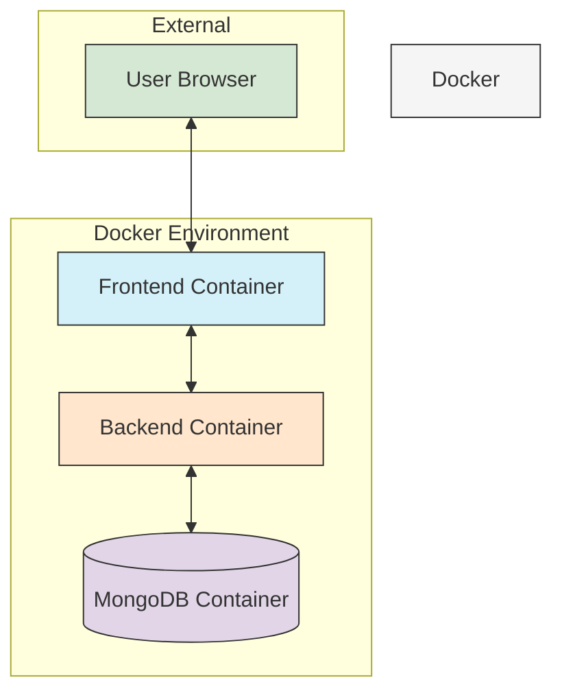

## Error Handling Flow

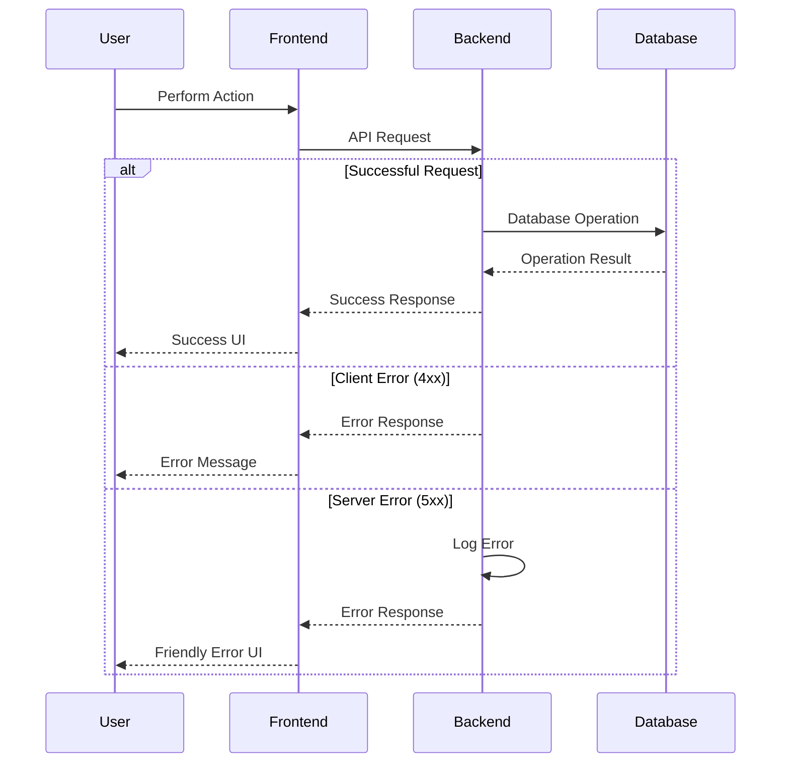