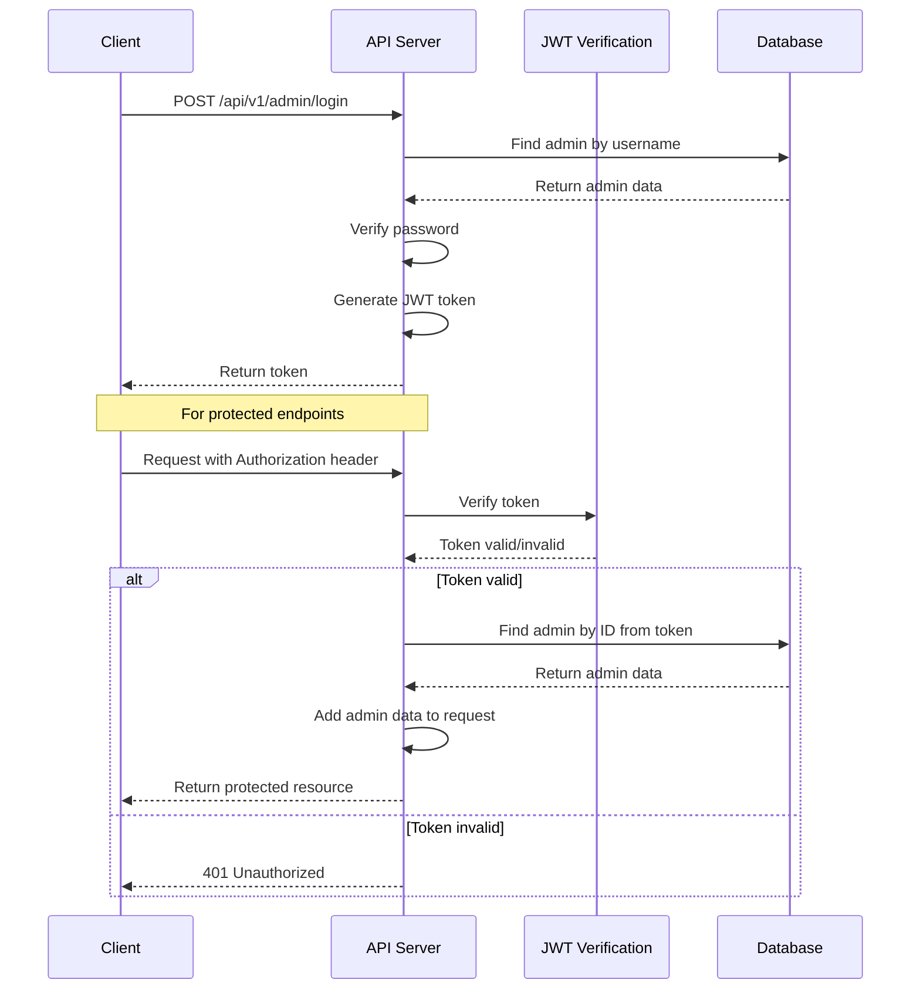
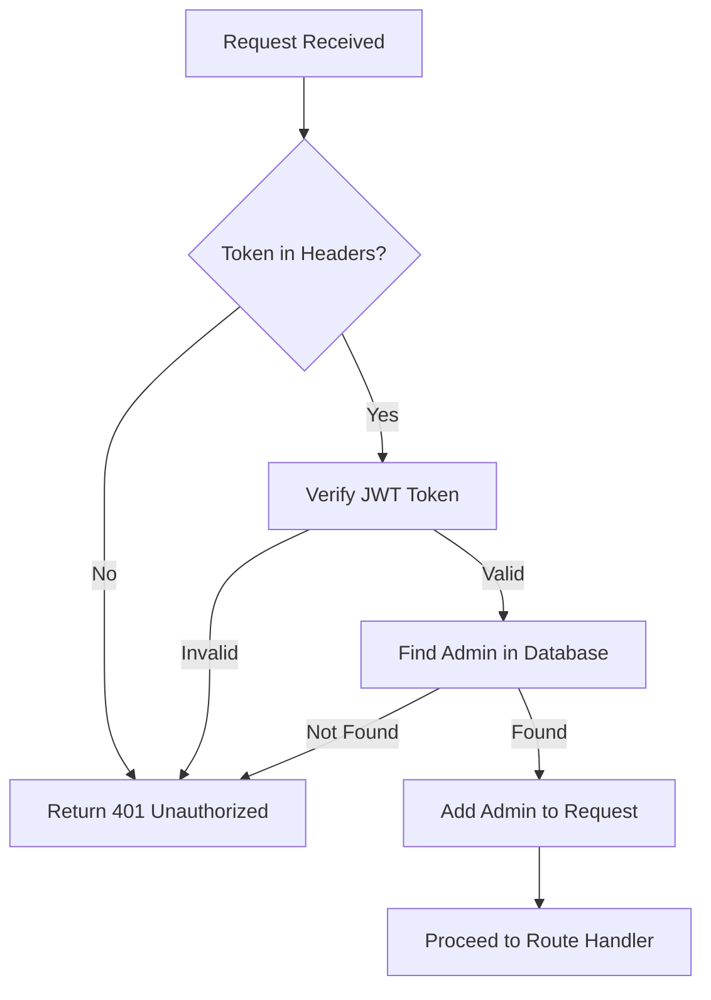
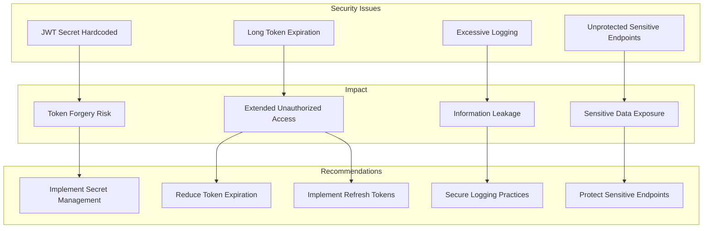
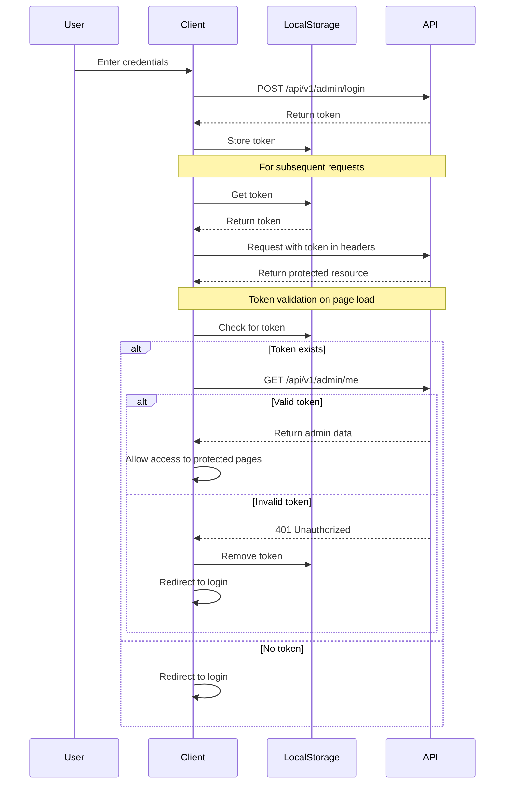

# Authentication Analysis for Quizzy-Gen API

This document provides a detailed analysis of the authentication system in the Quizzy-Gen API, including which endpoints are protected, how authentication works, and security issues that need to be addressed.

## Authentication Flow



## API Endpoints Authentication Status

```mermaid
graph TD
    subgraph "Authentication Status"
        Protected[Protected Endpoints]
        Unprotected[Unprotected Endpoints]
    end

    subgraph "Admin Routes"
        A1[POST /admin/register] --> Protected
        A2[POST /admin/login] --> Unprotected
        A3[GET /admin/me] --> Protected
    end

    subgraph "Chapter Routes"
        C1[GET /chapters] --> Unprotected
        C2[GET /chapters/:id] --> Unprotected
        C3[GET /chapters/:id/questions] --> Unprotected
    end

    subgraph "Question Routes"
        Q1[GET /questions] --> Unprotected
        Q2[GET /questions/:id] --> Unprotected
    end

    subgraph "Quiz Routes"
        QZ1[POST /quizzes] --> Unprotected
        QZ2[GET /quizzes] --> Unprotected
        QZ3[GET /quizzes/:id] --> Unprotected
        QZ4[GET /quizzes/link/:shareableLink] --> Unprotected
    end

    subgraph "Quiz Attempt Routes"
        QA1[POST /quiz-attempts] --> Unprotected
        QA2[GET /quiz-attempts/:id] --> Unprotected
    end
```



## Authentication Middleware Implementation



## Authentication Issues and Vulnerabilities



## Detailed Endpoint Analysis

| Endpoint | Method | Protected | Should Be Protected | Notes |
|----------|--------|-----------|---------------------|-------|
| `/api/v1/admin/register` | POST | ✅ Yes | ✅ Yes | Requires super_admin role |
| `/api/v1/admin/login` | POST | ❌ No | ❌ No | Public endpoint for authentication |
| `/api/v1/admin/me` | GET | ✅ Yes | ✅ Yes | Returns current admin info |
| `/api/v1/chapters` | GET | ❌ No | ❌ No | Public data |
| `/api/v1/chapters/:id` | GET | ❌ No | ❌ No | Public data |
| `/api/v1/chapters/:id/questions` | GET | ❌ No | ❌ No | Public data |
| `/api/v1/questions` | GET | ❌ No | ❌ No | Public data |
| `/api/v1/questions/:id` | GET | ❌ No | ❌ No | Public data |
| `/api/v1/quizzes` | POST | ❌ No | ✅ Yes | **Should be protected** - Creating quizzes should require authentication |
| `/api/v1/quizzes` | GET | ❌ No | ❌ No | Public data |
| `/api/v1/quizzes/:id` | GET | ❌ No | ❌ No | Public data |
| `/api/v1/quizzes/link/:shareableLink` | GET | ❌ No | ❌ No | Public data |
| `/api/v1/quiz-attempts` | POST | ❌ No | ❌ No | Public endpoint for submitting quiz attempts |
| `/api/v1/quiz-attempts/:id` | GET | ❌ No | ✅ Yes | **Should be protected** - Viewing quiz attempts should require authentication |

## Client-Side Authentication Implementation



## Authentication Security Issues

### 1. JWT Secret Configuration

The JWT secret is hardcoded in the `.env` file as `your_super_secret_jwt_key_for_quizzy_gen_app`. This presents a significant security risk as:

- The secret is predictable and not cryptographically strong
- It appears to be a placeholder that was never replaced with a proper secret
- The secret is stored in a file that might be committed to version control

### 2. Token Expiration

The token expiration is set to 7 days (`JWT_EXPIRES_IN=7d`), which is excessively long for a session token. Long-lived tokens increase the window of opportunity for token theft and misuse.

### 3. Unprotected Sensitive Endpoints

Several endpoints that should require authentication are not protected:

- **POST /api/v1/quizzes**: Creating quizzes should require authentication to prevent spam and abuse
- **GET /api/v1/quiz-attempts/:id**: Viewing quiz attempts should require authentication to protect user privacy

### 4. Excessive Logging

The authentication middleware logs sensitive information:
- Full request headers
- Token values
- Decoded token payload
- Admin information

This creates a risk of information leakage through log files.

## Recommendations

1. **Protect Sensitive Endpoints**: Add the `auth` middleware to the following routes:
   ```javascript
   // In quizzes.js
   router.post('/', auth, async (req, res) => { ... });
   
   // In quizAttempts.js
   router.get('/:id', auth, async (req, res) => { ... });
   ```
